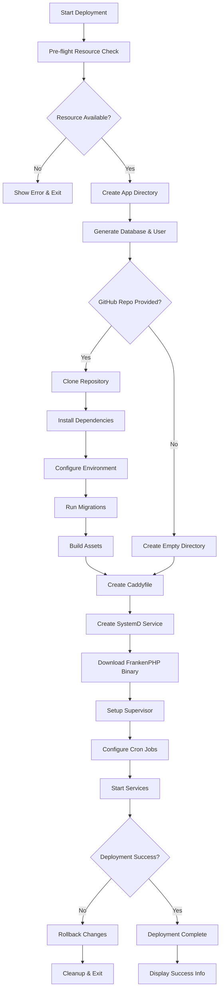
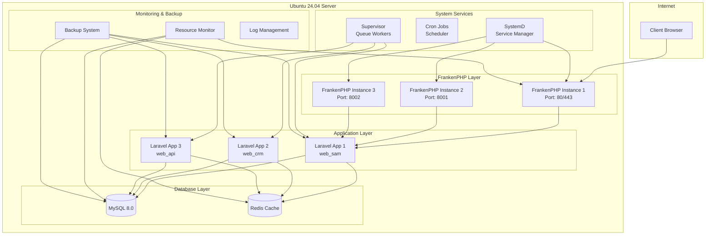
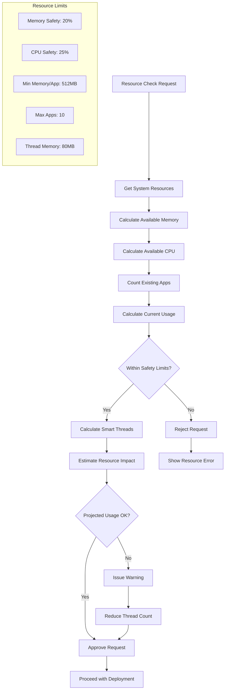
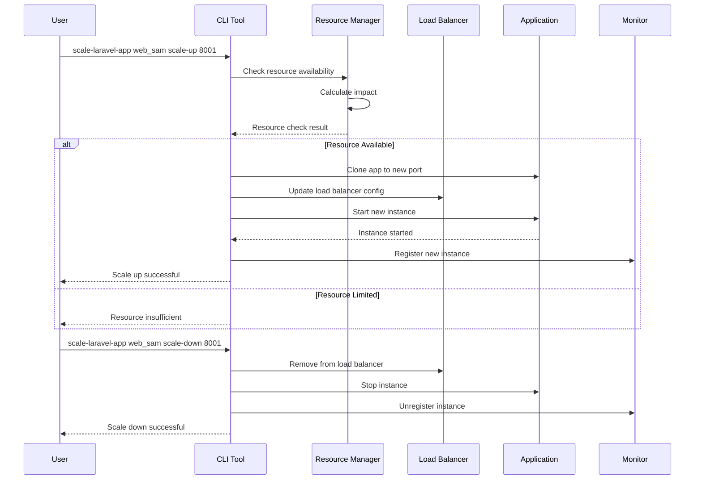
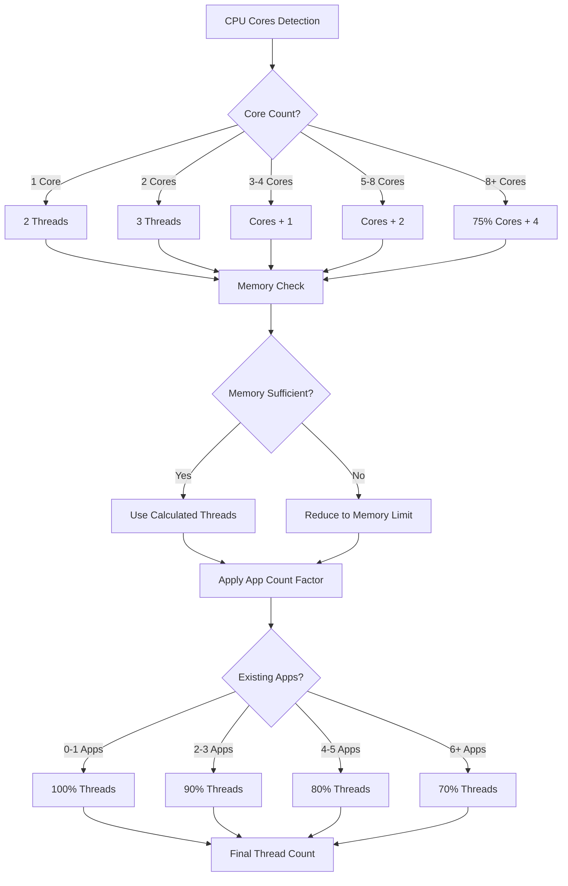
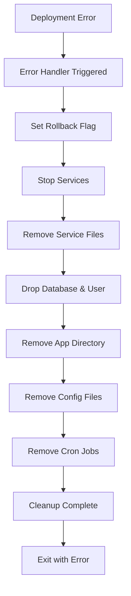

# FrankenPHP Multi-App Deployer

**Repository**: [https://github.com/MekayaStudio/FrankLaraPloy](https://github.com/MekayaStudio/FrankLaraPloy)

Script deployment otomatis untuk aplikasi Laravel menggunakan FrankenPHP di Ubuntu 24.04 dengan fitur multi-app, horizontal scaling, dan sistem monitoring resource yang cerdas.

## 🚀 Fitur Utama

- **Embedded PHP Server**: Tidak memerlukan PHP-FPM, menggunakan server PHP terintegrasi
- **Built-in Caddy Web Server**: Server web dengan konfigurasi otomatis
- **Auto HTTPS**: Sertifikat SSL otomatis dengan Let's Encrypt
- **Horizontal Scaling**: Load balancer dengan scaling otomatis
- **Multi-App Support**: Isolasi aplikasi dengan resource management
- **GitHub Integration**: Auto-deployment dari repository GitHub
- **Error Handling & Rollback**: Sistem rollback otomatis jika deployment gagal
- **Resource Awareness**: Monitoring dan optimasi resource secara real-time
- **Dynamic Thread Allocation**: Alokasi thread otomatis berdasarkan kapasitas server

## 📋 Persyaratan Sistem

- **OS**: Ubuntu 24.04 LTS
- **RAM**: Minimal 2GB (Recommended: 4GB+)
- **CPU**: Minimal 2 cores (Recommended: 4+ cores)
- **Storage**: Minimal 20GB free space
- **Network**: Akses internet untuk download dependencies
- **Privileges**: Root access untuk setup awal

## 🔧 Alternatif Instalasi

### Instalasi via Git Clone
```bash
# Clone repository
git clone https://github.com/MekayaStudio/FrankLaraPloy.git
cd FrankLaraPloy

# Jalankan script
sudo ./frankenphp-multiapp-deployer.sh
```

### Instalasi via Curl
```bash
# Download dan jalankan langsung
curl -sSL https://raw.githubusercontent.com/MekayaStudio/FrankLaraPloy/main/frankenphp-multiapp-deployer.sh | sudo bash
```

### Verifikasi Instalasi
```bash
# Cek version dan available commands
create-laravel-app --help
list-laravel-apps
monitor-server-resources
```

## 🔗 Quick Start

Untuk memulai dengan cepat:

```bash
# Download script
wget https://raw.githubusercontent.com/MekayaStudio/FrankLaraPloy/main/frankenphp-multiapp-deployer.sh

# Buat executable
chmod +x frankenphp-multiapp-deployer.sh

# Jalankan setup (butuh sudo)
sudo ./frankenphp-multiapp-deployer.sh

# Buat aplikasi Laravel pertama
create-laravel-app web_sam domain.com https://github.com/user/laravel-app.git

# Start aplikasi
systemctl start frankenphp-web_sam
```

## 🛠️ Instalasi

### 1. Download Script
```bash
wget https://raw.githubusercontent.com/MekayaStudio/FrankLaraPloy/main/frankenphp-multiapp-deployer.sh
chmod +x frankenphp-multiapp-deployer.sh
```

### 2. Jalankan Setup Awal
```bash
sudo ./frankenphp-multiapp-deployer.sh
```

Script akan secara otomatis:
- Update sistem dan install dependencies
- Install PHP 8.3 dengan ekstensi yang diperlukan
- Install Composer, Node.js, MySQL, Redis
- Konfigurasi firewall dan security
- Setup struktur direktori dan service

## 📚 Perintah yang Tersedia

### Manajemen Aplikasi
```bash
# Membuat aplikasi baru
create-laravel-app <nama-app> <domain> [github-repo] [nama-db]

# Deploy aplikasi
deploy-laravel-app <nama-app>

# Lihat daftar aplikasi
list-laravel-apps

# Hapus aplikasi
remove-laravel-app <nama-app>

# Aktifkan HTTPS
enable-https-app <nama-app>

# Status aplikasi
status-laravel-app <nama-app>
```

### Horizontal Scaling
```bash
# Scale up aplikasi
scale-laravel-app <nama-app> scale-up <port>

# Scale down aplikasi
scale-laravel-app <nama-app> scale-down <port>
```

### Resource Monitoring
```bash
# Monitor resource server real-time
monitor-server-resources

# Analisis resource aplikasi
analyze-app-resources

# Prediksi dampak perubahan
predict-resource-impact <action>

# Rekomendasi optimasi
optimize-server-resources
```

### Backup & Maintenance
```bash
# Backup semua aplikasi
backup-all-laravel-apps
```

## 🎯 Contoh Penggunaan

### Membuat Aplikasi dari GitHub
```bash
# Contoh aplikasi web-sam
create-laravel-app web_sam testingsetup.rizqis.com https://github.com/CompleteLabs/web-app-sam.git

# Contoh aplikasi CRM
create-laravel-app web_crm_app crm.completelabs.com https://github.com/user/laravel-crm.git
```

### Membuat Aplikasi Kosong
```bash
# Membuat aplikasi kosong untuk manual deployment
create-laravel-app web_api_service api.completelabs.com
```

### Horizontal Scaling
```bash
# Scale up aplikasi web_sam ke port 8001
scale-laravel-app web_sam_l12 scale-up 8001

# Scale up lagi ke port 8002
scale-laravel-app web_sam_l12 scale-up 8002

# Cek status scaling
status-laravel-app web_sam_l12

# Scale down dari port 8002
scale-laravel-app web_sam_l12 scale-down 8002
```

## 📊 Workflow Deployment



## 🔧 Arsitektur Sistem



## 🧠 Resource Management System



## 🔄 Horizontal Scaling Process



## 📁 Struktur Direktori

```
/opt/laravel-apps/              # Base directory untuk semua aplikasi
├── web_sam/                    # Aplikasi web_sam
│   ├── app/                    # Source code Laravel
│   ├── public/                 # Public assets
│   ├── storage/                # Storage & logs
│   ├── Caddyfile              # Konfigurasi Caddy
│   ├── frankenphp             # FrankenPHP binary
│   └── .env                   # Environment variables
├── web_crm/                   # Aplikasi web_crm
└── web_api/                   # Aplikasi web_api

/etc/laravel-apps/             # Konfigurasi aplikasi
├── web_sam.conf               # Config web_sam
├── web_crm.conf               # Config web_crm
└── web_api.conf               # Config web_api

/var/log/frankenphp/           # Log FrankenPHP
├── web_sam.log                # Log aplikasi web_sam
├── web_crm.log                # Log aplikasi web_crm
└── web_api.log                # Log aplikasi web_api

/var/backups/laravel-apps/     # Backup aplikasi
└── 20250715_120000/           # Backup dengan timestamp
    ├── web_sam_database.sql
    ├── web_sam_app.tar.gz
    └── ...
```

## 🛡️ Security Features

### Firewall Configuration
- Port 22 (SSH): Enabled
- Port 80 (HTTP): Enabled
- Port 443 (HTTPS): Enabled
- Semua port lain: Disabled by default

### Application Security
- **NoNewPrivileges**: Mencegah privilege escalation
- **PrivateTmp**: Isolated temporary directories
- **ProtectSystem**: Read-only system directories
- **ProtectHome**: Protected home directories

### Database Security
- Random generated passwords
- User isolation per aplikasi
- Root credentials protected di `/root/.mysql_credentials`

## 🔍 Resource Monitoring

### Real-time Monitoring
```bash
# Monitor real-time resource usage
monitor-server-resources

# Output:
# 📊 SERVER RESOURCE MONITORING
# 💾 Memory: 2.1GB / 8.0GB (26%)
# 🔥 CPU: 15.2% (4 cores)
# 🏗️ Apps: 3 / 10
# 🧵 Threads: 12 total
```

### Resource Analysis
```bash
# Analisis detail resource per aplikasi
analyze-app-resources

# Output:
# 📊 DETAILED APP RESOURCE ANALYSIS
# App: web_sam | Threads: 4 | Memory: ~320MB | Status: active
# App: web_crm | Threads: 3 | Memory: ~240MB | Status: active
```

### Impact Prediction
```bash
# Prediksi dampak sebelum membuat perubahan
predict-resource-impact new-app web_new_app

# Output:
# 🔮 RESOURCE IMPACT PREDICTION
# Action: Creating new app 'web_new_app'
# Estimated threads: 3
# Estimated memory: 240MB
# Projected total memory: 45% (+10%)
```

## 🎛️ Konfigurasi Optimal

### Thread Allocation Logic


### Memory Management
- **Safety Margin**: 20% dari total memory reserved
- **Per Thread**: ~80MB memory usage
- **Per App Minimum**: 512MB
- **Per App Maximum**: 2048MB

## 🚨 Error Handling & Rollback

### Rollback Mechanism


### Error Types
- **Resource Insufficient**: Pre-flight check gagal
- **Database Error**: Gagal create database/user
- **GitHub Clone Error**: Gagal clone repository
- **Dependencies Error**: Gagal install composer/npm
- **Service Start Error**: Gagal start FrankenPHP service

## 📈 Performance Optimization

### Caching Strategy
- **OPcache**: Enabled untuk PHP bytecode caching
- **Redis**: Session dan cache storage
- **Route/Config Cache**: Laravel optimization

### Database Optimization
- **Connection Pooling**: Efficient database connections
- **Query Optimization**: Indexed queries
- **Backup Strategy**: Daily automated backups

## 🔧 Troubleshooting

### Common Issues

#### 1. App Name Invalid
```bash
# Error: Invalid app name
# Solution: Gunakan format yang valid
create-laravel-app web_sam_l12 domain.com  # ✅ Valid
create-laravel-app web-sam-l12 domain.com  # ❌ Invalid (dash)
```

#### 2. Resource Insufficient
```bash
# Error: Pre-flight check failed
# Solution: Optimize existing apps atau upgrade server
optimize-server-resources
```

#### 3. Service Failed to Start
```bash
# Check service status
systemctl status frankenphp-web_sam

# Check logs
journalctl -u frankenphp-web_sam -f
```

#### 4. Database Connection Error
```bash
# Check database credentials
cat /etc/laravel-apps/web_sam.conf

# Test database connection
mysql -u web_sam_user -p web_sam_db
```

### Log Locations
- **Application Logs**: `/opt/laravel-apps/{app_name}/storage/logs/`
- **FrankenPHP Logs**: `/var/log/frankenphp/{app_name}.log`
- **System Logs**: `journalctl -u frankenphp-{app_name}`

## 📝 Naming Convention

### App Names
- **Valid**: `web_sam`, `web_sam_l12`, `webSamL12`, `web_crm_app`
- **Invalid**: `web-sam`, `web sam`, `123web`, `web@sam`

### Rules
- Harus dimulai dengan huruf
- Hanya boleh menggunakan huruf, angka, dan underscore
- Tidak boleh menggunakan dash, spasi, atau karakter khusus
- Kompatibel dengan MySQL user/database names

## 🔄 Backup & Recovery

### Automated Backup
```bash
# Daily backup (already configured)
0 2 * * * /usr/local/bin/backup-all-laravel-apps
```

### Manual Backup
```bash
# Backup semua aplikasi
backup-all-laravel-apps

# Backup location
ls -la /var/backups/laravel-apps/
```

### Recovery Process
```bash
# Restore from backup
cd /var/backups/laravel-apps/20250715_120000/

# Restore database
mysql -u root -p web_sam_db < web_sam_database.sql

# Restore application
tar -xzf web_sam_app.tar.gz -C /opt/laravel-apps/web_sam/
```

## 🎯 Best Practices

### 1. Resource Planning
- Monitor resource usage secara berkala
- Gunakan `predict-resource-impact` sebelum deployment
- Jaga memory usage di bawah 80%

### 2. Application Management
- Gunakan naming convention yang konsisten
- Backup sebelum major changes
- Test di development environment dulu

### 3. Security
- Update sistem secara berkala
- Monitor log files untuk suspicious activities
- Gunakan strong passwords untuk database

### 4. Performance
- Optimize database queries
- Gunakan caching strategies
- Monitor thread allocation

## 📞 Support

### Resources
- **GitHub Repository**: [https://github.com/MekayaStudio/FrankLaraPloy](https://github.com/MekayaStudio/FrankLaraPloy)
- **Documentation**: Script ini self-documented
- **Issues**: Report bugs dan request features di GitHub Issues
- **Logs**: Check log files untuk troubleshooting
- **Community**: Diskusi dan sharing pengalaman

### Contributing
Kontribusi selalu welcome! Silakan:
1. Fork repository di [https://github.com/MekayaStudio/FrankLaraPloy](https://github.com/MekayaStudio/FrankLaraPloy)
2. Buat branch baru untuk feature/bugfix
3. Submit pull request dengan deskripsi yang jelas
4. Report issues untuk bug atau feature request

## 📄 License

MIT License - bebas digunakan untuk project personal maupun komersial.

---

**🎉 Selamat menggunakan FrankenPHP Multi-App Deployer!**

Script ini dirancang untuk memudahkan deployment dan management aplikasi Laravel dengan performa tinggi dan resource management yang cerdas.
