# FrankenPHP Multi-App Deployer 🚀

> **Laravel Octane Management Tool dengan FrankenPHP** - Deploy multiple Laravel apps dengan mudah!

[](https://github.com/MekayaStudio/FrankLaraPloy)
[](LICENSE)
[](https://php.net)
[](https://laravel.com)

## 🌟 Features

- ✅ **Laravel Octane** dengan FrankenPHP (embedded web server)
- ✅ **Automatic HTTPS** dengan Let's Encrypt (built-in)
- ✅ **HTTP/HTTPS dual mode** support 
- ✅ **Built-in PHP runtime** (tidak perlu PHP-FPM)
- ✅ **HTTP/2 dan HTTP/3** support
- ✅ **Automatic database** setup
- ✅ **Systemd service** management
- ✅ **Queue worker** management
- ✅ **Scheduler** setup
- ✅ **Production optimization**
- ✅ **Zero-config SSL** certificates

## 📋 Daftar Isi

- [Quick Start](#-quick-start)
- [System Requirements](#-system-requirements)
- [Installation](#-installation)
- [Command Reference](#-command-reference)
- [HTTP/HTTPS Modes](#-httphttps-modes)
- [Architecture](#-architecture)
- [Workflow](#-workflow)
- [Examples](#-examples)
- [Troubleshooting](#-troubleshooting)
- [Advanced Usage](#-advanced-usage)

## 🚀 Quick Start

```bash
# 1. Clone repository
git clone https://github.com/MekayaStudio/FrankLaraPloy.git
cd FrankLaraPloy

# 2. Setup system (install FrankenPHP, MySQL, dependencies)
sudo ./install.sh setup

# 3. Deploy Laravel app
sudo ./install.sh install myapp mydomain.com

# 4. Check status
sudo ./install.sh status myapp
```

## 💻 System Requirements

- **OS**: Ubuntu 20.04+ / Debian 11+
- **Memory**: Minimum 1GB RAM (2GB+ recommended)
- **Storage**: Minimum 2GB free space
- **Network**: Port 80, 443 accessible (untuk SSL)
- **Privileges**: Root access required

## 📦 Installation

### Step 1: Download dan Persiapan

```bash
# Download script
wget https://github.com/MekayaStudio/FrankLaraPloy/archive/main.zip
unzip main.zip
cd FrankLaraPloy-main

# Atau clone dari git
git clone https://github.com/MekayaStudio/FrankLaraPloy.git
cd FrankLaraPloy

# Make executable
chmod +x install.sh
```

### Step 2: System Setup

```bash
# Setup lengkap sistem
sudo ./install.sh setup
```

Proses ini akan menginstall:
- FrankenPHP binary
- MySQL server
- Redis server
- Node.js & NPM
- Composer
- Dependencies lainnya

## 🛠️ Command Reference

### System Commands

| Command | Description |
|---------|-------------|
| `sudo ./install.sh setup` | Setup sistem dengan FrankenPHP + Laravel Octane |
| `sudo ./install.sh debug [app]` | Debug sistem atau aplikasi spesifik |

### App Management

| Command | Description |
|---------|-------------|
| `sudo ./install.sh install <app> <domain> [repo] [db-name] [octane-mode] [http-mode]` | Install Laravel app baru |
| `sudo ./install.sh remove <app>` | Hapus Laravel app |
| `sudo ./install.sh list` | List semua aplikasi yang terinstall |
| `sudo ./install.sh resources` | Tampilkan penggunaan resource multi-app |
| `sudo ./install.sh status <app>` | Tampilkan status aplikasi |
| `sudo ./install.sh logs <app> [lines]` | Tampilkan log aplikasi |

### Service Management

| Command | Description |
|---------|-------------|
| `sudo ./install.sh systemd:check <app>` | Cek systemd service |
| `sudo ./install.sh systemd:fix <app>` | Perbaiki systemd service |
| `sudo ./install.sh systemd:fix-all` | Perbaiki semua systemd services |
| `sudo ./install.sh systemd:list` | List semua services |

### Database Management

| Command | Description |
|---------|-------------|
| `sudo ./install.sh db:check <app>` | Cek koneksi database |
| `sudo ./install.sh db:fix <app>` | Perbaiki masalah database |
| `sudo ./install.sh db:reset <app>` | Reset database |
| `sudo ./install.sh db:list` | List database aplikasi |
| `sudo ./install.sh db:status` | Tampilkan status MySQL |

### Octane Management

| Command | Description |
|---------|-------------|
| `sudo ./install.sh octane:install <app>` | Install Octane di aplikasi existing |
| `sudo ./install.sh octane:start <app>` | Start Octane server |
| `sudo ./install.sh octane:stop <app>` | Stop Octane server |
| `sudo ./install.sh octane:restart <app>` | Restart Octane server |
| `sudo ./install.sh octane:status <app>` | Tampilkan status Octane |

### Octane Dual Mode (HTTP/HTTPS)

| Command | Description |
|---------|-------------|
| `sudo ./install.sh octane:dual <app> [mode]` | Konfigurasi dual mode |
| `sudo ./install.sh octane:start-dual <app> [mode]` | Start dual mode services |
| `sudo ./install.sh octane:stop-dual <app> [mode]` | Stop dual mode services |
| `sudo ./install.sh octane:status-dual <app> [mode]` | Tampilkan status dual mode |
| `sudo ./install.sh octane:restart-dual <app> [mode]` | Restart dual mode services |

### SSL Management

| Command | Description |
|---------|-------------|
| `sudo ./install.sh ssl:status <app>` | Tampilkan status SSL (otomatis via FrankenPHP) |
| `sudo ./install.sh ssl:info` | Tampilkan informasi SSL |

## 🌐 HTTP/HTTPS Modes

| Mode | Description | Use Case |
|------|-------------|----------|
| `http-only` | Hanya HTTP (port 80) | Development/testing |
| `https-only` | Hanya HTTPS dengan HTTP redirect (port 443) | Production dengan keamanan tinggi |
| `dual` | HTTP dan HTTPS (tanpa redirect) | Kompatibilitas maksimum |

## 🏗️ Architecture


## 🔄 Workflow

### 1. System Setup Workflow


### 2. App Installation Workflow

```mermaid
flowchart TD
    START([Install App]) --> VALIDATE{Validate Input}
    VALIDATE -->|Invalid| ERROR[❌ Validation Error]
    VALIDATE -->|Valid| CHECK_EXIST{App Exists?}
    CHECK_EXIST -->|Yes| ERROR_EXIST[❌ App already exists]
    CHECK_EXIST -->|No| CREATE_DIR[📁 Create app directory]
    CREATE_DIR --> CLONE_OR_NEW{From Repository?}
    CLONE_OR_NEW -->|Repository| CLONE[📥 Clone repository]
    CLONE_OR_NEW -->|New| CREATE_LARAVEL[🆕 Create Laravel project]
    CLONE --> INSTALL_DEPS[📦 Install dependencies]
    CREATE_LARAVEL --> INSTALL_DEPS
    INSTALL_DEPS --> SETUP_ENV[⚙️ Setup .env file]
    SETUP_ENV --> CREATE_DB[🗄️ Create database]
    CREATE_DB --> MIGRATE[🔄 Run migrations]
    MIGRATE --> INSTALL_OCTANE[🚀 Install Octane]
    INSTALL_OCTANE --> SELECT_MODE{Select HTTP Mode}
    SELECT_MODE --> CONFIG_HTTP[⚙️ Configure HTTP/HTTPS]
    CONFIG_HTTP --> CREATE_SYSTEMD[📋 Create systemd services]
    CREATE_SYSTEMD --> START_SERVICES[▶️ Start services]
    START_SERVICES --> SUCCESS[✅ App Installed]
    
    ERROR --> END([End])
    ERROR_EXIST --> END
    SUCCESS --> END
```



### 3. Service Management Workflow

```mermaid
flowchart TD
    START([Service Command]) --> IDENTIFY{Identify Command}
    
    IDENTIFY -->|start| START_SVC[▶️ Start Service]
    IDENTIFY -->|stop| STOP_SVC[⏹️ Stop Service]
    IDENTIFY -->|restart| RESTART_SVC[🔄 Restart Service]
    IDENTIFY -->|status| CHECK_SVC[📊 Check Status]
    IDENTIFY -->|fix| FIX_SVC[🔧 Fix Service]
    
    START_SVC --> CHECK_CONFIG{Config Valid?}
    CHECK_CONFIG -->|No| FIX_CONFIG[🔧 Fix Configuration]
    CHECK_CONFIG -->|Yes| SYSTEMCTL_START[systemctl start]
    FIX_CONFIG --> SYSTEMCTL_START
    SYSTEMCTL_START --> VERIFY_START{Service Running?}
    VERIFY_START -->|No| ERROR_START[❌ Start Failed]
    VERIFY_START -->|Yes| SUCCESS_START[✅ Started]
    
    STOP_SVC --> SYSTEMCTL_STOP[systemctl stop]
    SYSTEMCTL_STOP --> SUCCESS_STOP[✅ Stopped]
    
    RESTART_SVC --> SYSTEMCTL_RESTART[systemctl restart]
    SYSTEMCTL_RESTART --> SUCCESS_RESTART[✅ Restarted]
    
    CHECK_SVC --> SHOW_STATUS[📊 Show Status Info]
    SHOW_STATUS --> SUCCESS_STATUS[✅ Status Shown]
    
    FIX_SVC --> DIAGNOSE[🔍 Diagnose Issues]
    DIAGNOSE --> REPAIR[🔧 Repair Configuration]
    REPAIR --> TEST_FIX[🧪 Test Fix]
    TEST_FIX --> SUCCESS_FIX[✅ Fixed]
    
    ERROR_START --> END([End])
    SUCCESS_START --> END
    SUCCESS_STOP --> END
    SUCCESS_RESTART --> END
    SUCCESS_STATUS --> END
    SUCCESS_FIX --> END
```



## 💡 Examples

### Basic Usage

```bash
# Setup sistem
sudo ./install.sh setup

# Install app sederhana
sudo ./install.sh install blog myblog.com

# Install dengan mode HTTPS-only
sudo ./install.sh install shop myshop.com "" "" smart https-only

# Install dari GitHub repository
sudo ./install.sh install api api.mydomain.com https://github.com/user/laravel-api.git api_db smart dual
```

### Advanced Usage

```bash
# Konfigurasi dual mode untuk app existing
sudo ./install.sh octane:dual myapp dual

# Start dual mode services
sudo ./install.sh octane:start-dual myapp dual

# Check status dual mode
sudo ./install.sh octane:status-dual myapp dual

# Debug app specific
sudo ./install.sh debug myapp

# Fix semua systemd services
sudo ./install.sh systemd:fix-all
```

### Database Management

```bash
# Check database connection
sudo ./install.sh db:check myapp

# List semua database apps
sudo ./install.sh db:list

# Reset database
sudo ./install.sh db:reset myapp

# Check MySQL status
sudo ./install.sh db:status
```

## 🔧 Troubleshooting

### Common Issues

#### 1. Permission Errors
```bash
# Pastikan menggunakan sudo
sudo ./install.sh command

# Check file permissions
ls -la install.sh
# Should show: -rwxr-xr-x
```

#### 2. Service Not Starting
```bash
# Check service status
sudo ./install.sh systemd:check appname

# Fix service configuration
sudo ./install.sh systemd:fix appname

# Check logs
sudo ./install.sh logs appname 50
```

#### 3. Database Connection Issues
```bash
# Check MySQL service
sudo ./install.sh db:status

# Check app database
sudo ./install.sh db:check appname

# Fix database issues
sudo ./install.sh db:fix appname
```

#### 4. SSL Certificate Issues
```bash
# Check SSL status
sudo ./install.sh ssl:status appname

# View SSL info
sudo ./install.sh ssl:info

# Note: SSL certificates are managed automatically by FrankenPHP
```

### Debug Tools

```bash
# System debug overview
sudo ./install.sh debug

# App-specific debug
sudo ./install.sh debug appname

# Check all services
sudo ./install.sh systemd:list

# Resource usage
sudo ./install.sh resources
```

## 🎯 Advanced Usage

### Multi-App Management

```bash
# Install multiple apps
sudo ./install.sh install app1 app1.domain.com
sudo ./install.sh install app2 app2.domain.com
sudo ./install.sh install app3 app3.domain.com

# Check resource usage
sudo ./install.sh resources

# List all apps
sudo ./install.sh list
```

### Performance Optimization

```bash
# Configure untuk production
sudo ./install.sh octane:dual app1 https-only
sudo ./install.sh octane:dual app2 https-only

# Monitor resource usage
watch "sudo ./install.sh resources"
```

### Backup & Maintenance

```bash
# Backup database
mysqldump appname_db > backup.sql

# Stop all services for maintenance
sudo ./install.sh systemd:list
sudo systemctl stop octane-*

# Start all services
sudo ./install.sh systemd:fix-all
```

## 📝 Configuration Files

### Directory Structure
```
/opt/laravel-apps/           # Apps base directory
├── app1/                    # App directory
│   ├── .env                 # Environment config
│   └── ...
/etc/laravel-apps/           # Configuration directory
├── app1.conf                # App-specific config
└── ...
/var/log/frankenphp/         # Log directory
├── app1.log                 # App logs
└── ...
```

### Environment Variables

Key environment variables yang dapat dikustomisasi:

```bash
# App paths
export APPS_BASE_DIR="/opt/laravel-apps"
export LOG_DIR="/var/log/frankenphp"
export CONFIG_DIR="/etc/laravel-apps"

# Resource limits
export MIN_MEMORY_PER_APP="512"
export MAX_MEMORY_PER_APP="2048"
export MAX_APPS_PER_SERVER="10"
```

## � Testing

Untuk memvalidasi semua command berfungsi dengan baik:

```bash
# Quick validation
bash validate-commands.sh

# Comprehensive testing
bash test-commands.sh
```

### Manual Testing Examples

```bash
# Test basic commands
sudo ./install.sh --help
sudo ./install.sh list
sudo ./install.sh systemd:list
sudo ./install.sh db:status
sudo ./install.sh ssl:info

# Test app creation (example)
sudo ./install.sh install testapp test.local

# Test app management
sudo ./install.sh status testapp
sudo ./install.sh logs testapp 20
sudo ./install.sh octane:status testapp

# Cleanup test
sudo ./install.sh remove testapp
```

## �🤝 Contributing

1. Fork repository
2. Create feature branch (`git checkout -b feature/amazing-feature`)
3. Commit changes (`git commit -m 'Add amazing feature'`)
4. Push ke branch (`git push origin feature/amazing-feature`)
5. Buat Pull Request

### Development Guidelines

- Test semua perubahan dengan `bash validate-commands.sh`
- Pastikan documentation up-to-date
- Follow existing code style
- Add proper error handling

## 📄 License

Project ini dilisensikan under MIT License - lihat file [LICENSE](LICENSE) untuk detail.

## 🆘 Support

Jika Anda mengalami masalah atau memiliki pertanyaan:

1. Check [Troubleshooting](#-troubleshooting) section
2. Buat [GitHub Issue](https://github.com/MekayaStudio/FrankLaraPloy/issues)
3. Baca dokumentasi FrankenPHP di [frankenphp.dev](https://frankenphp.dev)

## 🙏 Acknowledgments

- [FrankenPHP](https://frankenphp.dev) - Modern PHP app server
- [Laravel Octane](https://laravel.com/docs/octane) - High-performance Laravel
- [Let's Encrypt](https://letsencrypt.org) - Free SSL certificates

---

**Dibuat dengan ❤️ oleh [MekayaStudio](https://github.com/MekayaStudio)**

*Deploy Laravel apps dengan mudah menggunakan FrankenPHP!* 🚀
