# FrankLaraPloy: FrankenPHP Multi-App Deployer

[](https://opensource.org/licenses/MIT)
[]()
[]()

**Repository**: [https://github.com/MekayaStudio/FrankLaraPloy](https://github.com/MekayaStudio/FrankLaraPloy)

**FrankLaraPloy** adalah script deployment otomatis untuk menjalankan beberapa aplikasi Laravel pada satu server Ubuntu 24.04. Ditenagai oleh **FrankenPHP**, script ini menyederhanakan manajemen server, meningkatkan performa, dan menyediakan fitur-fitur canggih seperti scaling, monitoring, dan auto-rollback.

---

## 🚀 Fitur Utama

- **Multi-App Isolation**: Jalankan beberapa proyek Laravel dengan aman di satu server, masing-masing dengan konfigurasi dan resource yang terisolasi.
- **Intelligent Resource Management**: Alokasi thread otomatis dan pengecekan resource sebelum deployment untuk mencegah server overload.
- **One-Command Horizontal Scaling**: Scale-up atau scale-down aplikasi dengan mudah untuk menangani beban traffic yang fluktuatif.
- **Zero-Downtime Deployment**: Integrasi dengan GitHub untuk deployment otomatis tanpa mengganggu layanan.
- **Automated Security**: Konfigurasi server web Caddy dengan HTTPS otomatis (Let's Encrypt) dan service hardening.
- **Idempotent & Robust**: Script aman untuk dijalankan berulang kali, dilengkapi error handling dan mekanisme rollback otomatis.
- **Automated Backups**: Backup harian untuk file aplikasi dan database secara otomatis.

---

## 📋 Persyaratan

- **Sistem Operasi**: Ubuntu 24.04 LTS
- **RAM**: Minimal 2GB (Rekomendasi: 4GB+)
- **CPU**: Minimal 2 core (Rekomendasi: 4+ core)
- **Akses**: Root privileges

---

## 🔧 Instalasi & Quick Start

### 1. Jalankan Installer
Instalasi dapat dilakukan dengan satu perintah. Script akan mengurus semua dependensi (PHP, MySQL, Redis, dll), konfigurasi, dan security setup.

```bash
# Opsi 1: Curl
curl -sSL https://raw.githubusercontent.com/MekayaStudio/FrankLaraPloy/main/frankenphp-multiapp-deployer.sh | sudo bash

# Opsi 2: Wget
wget -qO- https://raw.githubusercontent.com/MekayaStudio/FrankLaraPloy/main/frankenphp-multiapp-deployer.sh | sudo bash
```

### 2. Buat Aplikasi Pertama Anda
Setelah instalasi selesai, Anda dapat langsung membuat aplikasi pertama.

```bash
# Buat aplikasi dari repository GitHub
create-laravel-app web_app_1 my-app.com https://github.com/user/laravel-app.git

# Atau buat aplikasi kosong untuk diisi manual
create-laravel-app api_service my-api.com
```

### 3. Kelola Aplikasi Anda
Gunakan perintah yang tersedia untuk mengelola aplikasi.

```bash
# Start service aplikasi
sudo systemctl start frankenphp-web_app_1

# Cek status semua aplikasi
list-laravel-apps

# Monitor resource server
monitor-server-resources
```

---

## 📚 Referensi Perintah

Semua perintah dapat diakses secara global setelah instalasi.

### Manajemen Aplikasi
| Perintah | Deskripsi |
|---|---|
| `create-laravel-app <nama> <domain> [repo] [db]` | Membuat aplikasi baru. |
| `deploy-laravel-app <nama>` | Menjalankan deployment (git pull, migrate, dll). |
| `list-laravel-apps` | Menampilkan daftar semua aplikasi dan statusnya. |
| `remove-laravel-app <nama>` | Menghapus aplikasi, database, dan konfigurasinya. |
| `status-laravel-app <nama>` | Menampilkan status detail sebuah aplikasi. |
| `enable-https-app <nama>` | Mengaktifkan HTTPS (Let's Encrypt) untuk domain. |

### Horizontal Scaling
| Perintah | Deskripsi |
|---|---|
| `scale-laravel-app <nama> scale-up <port>` | Menambah instance baru untuk load balancing. |
| `scale-laravel-app <nama> scale-down <port>`| Menghapus instance yang sudah ada. |

### Monitoring & Optimasi
| Perintah | Deskripsi |
|---|---|
| `monitor-server-resources` | Menampilkan ringkasan resource server secara real-time. |
| `analyze-app-resources` | Menampilkan analisis resource yang digunakan per aplikasi. |
| `predict-resource-impact <action>` | Memprediksi dampak resource dari sebuah tindakan (misal: `new-app`). |
| `optimize-server-resources` | Memberikan rekomendasi untuk optimasi resource. |

### Backup
| Perintah | Deskripsi |
|---|---|
| `backup-all-laravel-apps` | Menjalankan backup manual untuk semua aplikasi. |

---

## 🧠 Arsitektur & Konsep

### Arsitektur Sistem
Diagram ini menunjukkan bagaimana semua komponen saling berinteraksi.


### Alur Kerja Deployment
Proses deployment dirancang agar aman dengan pre-flight check dan rollback otomatis.

```mermaid
graph TD
    A[Start: `create-laravel-app`] --> B[1. Resource Check]
    B --> C{Cukup?}
    C -->|Tidak| D[Gagal & Exit]
    C -->|Ya| E[2. Setup App & DB]
    E --> F[3. Clone Repo & Install Deps]
    F --> G[4. Konfigurasi Service & Caddy]
    G --> H{Sukses?}
    H -->|Tidak| I[5. Rollback Otomatis]
    H -->|Ya| J[✅ Selesai]
```


---

## 🔧 Konfigurasi & Praktik Terbaik

### Struktur Direktori
```
/opt/laravel-apps/          # Base directory untuk semua aplikasi
├── web_app_1/              # Direktori aplikasi
│   ├── app/
│   ├── public/
│   ├── Caddyfile           # Konfigurasi Caddy spesifik
│   ├── frankenphp          # Binary FrankenPHP
│   └── .env
└── api_service/

/etc/laravel-apps/          # File konfigurasi global per aplikasi
├── web_app_1.conf
└── api_service.conf

/var/log/frankenphp/        # Log dari FrankenPHP
/var/backups/laravel-apps/  # Direktori backup harian
```

### Keamanan
- **Firewall (UFW)**: Hanya port 22, 80, dan 443 yang diizinkan.
- **Service Hardening**: Layanan systemd berjalan dengan privilese terbatas (`NoNewPrivileges`, `PrivateTmp`, `ProtectSystem`).
- **Database**: Setiap aplikasi memiliki user database sendiri dengan password acak.

### Aturan Penamaan Aplikasi
- **Valid**: `web_app`, `api_v2`, `project_name`
- **Tidak Valid**: `web-app` (hindari tanda hubung), `my app` (hindari spasi)
- **Aturan**: Gunakan huruf, angka, dan `_` (underscore). Harus dimulai dengan huruf.

---

## 🚨 Troubleshooting

- **Gagal Membuat Aplikasi**: Pastikan nama aplikasi dan domain valid. Cek `monitor-server-resources` untuk memastikan resource cukup.
- **Service Tidak Berjalan**: Gunakan `systemctl status frankenphp-<nama-app>` dan `journalctl -u frankenphp-<nama-app> -f` untuk melihat log error.
- **Error 5xx**: Cek log aplikasi di `/opt/laravel-apps/<nama-app>/storage/logs/laravel.log` dan log FrankenPHP di `/var/log/frankenphp/<nama-app>.log`.

---

## 🤝 Kontribusi

Kontribusi dalam bentuk apapun sangat kami hargai. Silakan buat *pull request* atau *issue* di repository GitHub.

## 📄 Lisensi

Proyek ini dilisensikan di bawah [MIT License](https://opensource.org/licenses/MIT).
